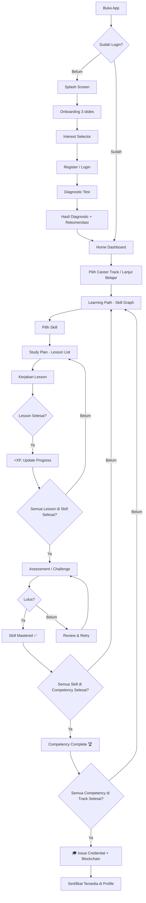
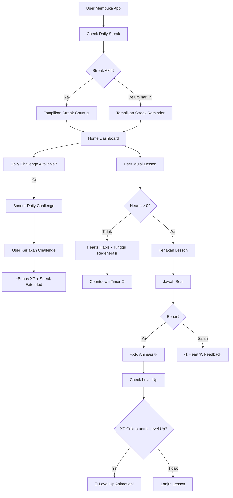

# 📱 Progressio Mobile — Product Requirements Document (PRD)

> **Version:** 1.0  
> **Platform:** Mobile Only (Flutter — Android & iOS)  
> **Tanggal:** 2 September 2026  
> **Project:** Progressio  
> **Tagline:** *Turning Progress Into Proof.*

---

## 1. Ringkasan Produk

Progressio Mobile adalah aplikasi pembelajaran coding dan informatika bergaya Duolingo yang dirancang untuk membuat proses belajar coding menjadi menyenangkan, terstruktur, dan terukur. Aplikasi ini menyesuaikan kurikulum secara personal berdasarkan minat dan kemampuan user, memberikan tantangan harian, melacak progres, dan di akhir perjalanan, menerbitkan **sertifikat yang diverifikasi blockchain** sebagai bukti kompetensi.

### 1.1 Masalah yang Dipecahkan

| Masalah | Solusi Progressio |
|---|---|
| Belajar coding terasa membosankan dan overwhelming | Gamifikasi ala Duolingo: XP, streak, hearts, daily challenge |
| Tidak tahu harus mulai dari mana | Diagnostic test + personalisasi kurikulum berdasarkan minat & level |
| Susah konsisten belajar | Streak system, reminder, daily goals |
| Sertifikat online tidak terpercaya | Sertifikat diverifikasi blockchain, bisa dicek publik |
| Tidak ada metrik kemajuan yang jelas | Skill graph, mastery level, progress tracking real-time |

### 1.2 Target User

**Semua kalangan (universal)** — mulai dari pelajar SMA/SMK, mahasiswa informatika, fresh graduate, hingga profesional yang ingin switch career ke tech. Desain UI/UX harus inklusif dan mudah dipahami tanpa background teknis sebelumnya.

### 1.3 Bahasa

**Bahasa Indonesia sepenuhnya** — semua konten UI, instruksi, materi pembelajaran, dan notifikasi menggunakan Bahasa Indonesia.

---

## 2. Tujuan Produk & Metrik Keberhasilan

### 2.1 Tujuan

1. **Engagement:** User belajar coding minimal 10 menit/hari secara konsisten
2. **Retention:** 40% D7 retention rate, 20% D30 retention rate
3. **Completion:** 25% user menyelesaikan minimal 1 career track
4. **Certification:** 15% user yang menyelesaikan track mendapatkan sertifikat blockchain

### 2.2 KPI Dashboard (Mobile)

| Metrik | Target MVP |
|---|---|
| DAU / MAU Ratio | ≥ 25% |
| Avg. Session Duration | ≥ 8 menit |
| Streak Retention (7-day) | ≥ 35% |
| Lesson Completion Rate | ≥ 70% |
| Assessment Pass Rate | ≥ 60% |
| Credential Issuance | ≥ 10% dari active users |

---

## 3. Platform & Teknologi

| Aspek | Pilihan |
|---|---|
| Framework | **Flutter (Dart)** — SDK ^3.11.0 |
| Arsitektur | **Clean Architecture** (3 Layer: Presentation → Domain → Data) |
| State Management | **BLoC / Cubit** (enterprise-grade, scalable, testable, cocok untuk app dengan banyak state kompleks seperti assessment, gamifikasi, dan real-time progress) |
| Navigasi | **GoRouter** (declarative routing) |
| HTTP Client | **Dio** (interceptor, retry, token refresh) |
| Local Storage | **SharedPreferences** + **flutter_secure_storage** |
| Dependency Injection | **get_it** + **injectable** |
| Backend | Django REST API (sudah tersedia) |
| Min Android | API 24 (Android 7.0) |
| Min iOS | iOS 14.0 |

### 3.1 Arsitektur Referensi

Mengacu pada [ARCHITECTURE.md](file:///d:/Aplikasi/Lomba_Joints/Progressio/Mobile/docs/ARCHITECTURE.md) yang sudah ada:

```
┌──────────────────────────────────────────────────────┐
│                   PRESENTATION                        │
│         (Pages, Widgets, BLoC/Cubit)                  │
├──────────────────────────────────────────────────────┤
│                      DOMAIN                           │
│      (Entity, UseCase, Repository Interface)          │
├──────────────────────────────────────────────────────┤
│                       DATA                            │
│   (Model, Repository Impl, DataSource, API)           │
└──────────────────────────────────────────────────────┘
```

---

## 4. Peta Fitur (Feature Map)

### 4.1 Overview Fitur

```
┌─────────────────────────────────────────────────────────────────┐
│                     PROGRESSIO MOBILE                           │
├───────────────┬────────────────┬────────────────┬───────────────┤
│  ONBOARDING   │   LEARNING     │  GAMIFICATION  │   SOCIAL      │
│               │   ENGINE       │                │               │
│ • Splash      │ • Career Track │ • XP System    │ • Leaderboard │
│ • Onboarding  │ • Diagnostic   │ • Streak       │ • Friend List │
│ • Interest    │ • Learning     │ • Hearts/Lives │ • Share       │
│   Selector    │   Path         │ • Daily Goal   │   Progress    │
│ • Register    │ • Lesson View  │ • Daily        │ • Profile     │
│ • Login       │ • Assessment   │   Challenge    │   Publik      │
│               │ • Study Plan   │ • Badges       │               │
│               │ • Roadmap      │ • Level Up     │               │
├───────────────┴────────────────┴────────────────┴───────────────┤
│                      CREDENTIAL                                  │
│                                                                  │
│ • Daftar Sertifikat    • Detail Sertifikat    • Verifikasi       │
│ • Blockchain Proof     • Share Sertifikat     • QR Code          │
└──────────────────────────────────────────────────────────────────┘
```

### 4.2 Prioritas Fitur (MoSCoW)

| Prioritas | Fitur |
|---|---|
| **Must Have** | Onboarding, Interest Selection, Diagnostic Test, Career Track, Learning Path, Lesson, Assessment, Progress Tracking, XP, Streak, Hearts, Credential, Profile |
| **Should Have** | Daily Challenge, Daily Goal, Leaderboard, Badge System, Push Notification, Offline Mode (cached lessons) |
| **Could Have** | Friend System, Share Progress, AI Tutor Chat, Dark Mode, Widget Home Screen |
| **Won't Have (MVP)** | In-app Code Editor, Video Call Mentor, Real-time Multiplayer Challenge, Payment/Subscription |

---

## 5. User Flow Detail

### 5.1 Flow Utama (Happy Path)



### 5.2 Flow Gamifikasi



---

## 6. Definisi Halaman (Screen Inventory)

### 6.1 Daftar Lengkap Halaman

> Setiap halaman merujuk ke folder di `lib/presentation/pages/` sesuai [ARCHITECTURE.md](file:///d:/Aplikasi/Lomba_Joints/Progressio/Mobile/docs/ARCHITECTURE.md).

| # | Halaman | Folder | Deskripsi |
|---|---|---|---|
| 1 | Splash | `splash/` | Logo + loading, auto-redirect |
| 2 | Onboarding | `onboarding/` | 3 slide pengantar fitur utama |
| 3 | Interest Selector | `interest_selector/` | Pilih topik yang diminati |
| 4 | Register | `auth/register/` | Daftar akun baru |
| 5 | Login | `auth/login/` | Masuk dengan email & password |
| 6 | Forgot Password | `auth/forgot_password/` | Reset password via email |
| 7 | Diagnostic Test | `diagnostic/` | Tes awal untuk ukur kemampuan |
| 8 | Diagnostic Result | `diagnostic_result/` | Hasil tes + rekomendasi track |
| 9 | Home Dashboard | `home/` | Hub utama + stats + current track |
| 10 | Career Tracks | `career_tracks/` | Daftar semua career track |
| 11 | Career Track Detail | `career_track_detail/` | Detail track + competency list |
| 12 | Learning Path | `learning_path/` | Visual skill graph (peta belajar) |
| 13 | Skill Detail | `skill_detail/` | Info skill + study plan |
| 14 | Lesson | `lesson/` | Konten pembelajaran (baca/video) |
| 15 | Quiz / Challenge | `assessment/` | Soal interaktif ala Duolingo |
| 16 | Assessment Result | `assessment_result/` | Hasil + feedback + XP gained |
| 17 | Daily Challenge | `daily_challenge/` | Tantangan harian bonus XP |
| 18 | Leaderboard | `leaderboard/` | Peringkat XP mingguan |
| 19 | Friends | `friends/` | Daftar teman + invite |
| 20 | Credentials | `credentials/` | Daftar sertifikat yang diperoleh |
| 21 | Credential Detail | `credential_detail/` | Detail + QR + blockchain proof |
| 22 | Share Credential | `share_credential/` | Preview share ke social media |
| 23 | Profile | `profile/` | Profil user + stats + settings |
| 24 | Settings | `settings/` | Pengaturan notifikasi, bahasa, dll |
| 25 | Roadmap | `roadmap/` | Rute terurut ke target skill |
| 26 | Notification | `notification/` | Daftar notifikasi |

---

## 7. Spesifikasi Detail per Halaman

### 7.1 Splash Screen

**Tujuan:** Branding + cek status autentikasi

**Komponen UI:**
- Logo Progressio (center, animasi fade-in + scale)
- Tagline "Turning Progress Into Proof" (animasi fade-in delayed)
- Loading indicator subtle

**Logic:**
1. Tampilkan splash selama 2 detik
2. Cek token JWT di secure storage
3. Jika valid → navigate ke Home
4. Jika expired → coba refresh token
5. Jika tidak ada token → navigate ke Onboarding
6. Jika pertama kali install → navigate ke Onboarding

**API:** Tidak ada (cek local storage saja)

---

### 7.2 Onboarding

**Tujuan:** Memperkenalkan fitur utama aplikasi ke user baru

**Komponen UI:**
- PageView horizontal (3 halaman), swipe-able
- Setiap halaman: Ilustrasi besar (60% layar) + Judul + Deskripsi
- Dot indicator (3 titik)
- Tombol "Selanjutnya" → slide berikutnya
- Tombol "Lewati" → langsung ke Interest Selector
- Slide terakhir: tombol "Mulai Belajar" → Interest Selector

**Konten Slide:**

| Slide | Judul | Deskripsi | Ilustrasi |
|---|---|---|---|
| 1 | Belajar Coding Jadi Seru | Pelajari coding dengan cara yang menyenangkan seperti bermain game | Ilustrasi character coding + game elements |
| 2 | Kurikulum Personal | AI menyesuaikan materi berdasarkan minat dan kemampuanmu | Ilustrasi skill tree / personalisasi |
| 3 | Raih Sertifikat Resmi | Buktikan kemampuanmu dengan sertifikat yang diverifikasi blockchain | Ilustrasi sertifikat + blockchain badge |

**API:** Tidak ada

---

### 7.3 Interest Selector

**Tujuan:** Mengetahui minat user untuk personalisasi kurikulum

**Komponen UI:**
- Header: "Apa yang ingin kamu pelajari?" (headline)
- Subtext: "Pilih topik yang menarik buatmu (bisa lebih dari satu)"
- Grid/chip list berisi topik-topik:
  - Backend Engineering
  - Frontend Development
  - Mobile Development
  - Data Science
  - Machine Learning / AI
  - Cybersecurity
  - DevOps & Cloud
  - Game Development
  - UI/UX Design
  - Blockchain / Web3
- Setiap chip/card:
  - Ikon representatif
  - Nama topik
  - State: unselected (outline) ↔ selected (filled + checkmark)
  - Animasi tap: scale bounce
- Tombol "Lanjutkan" (disabled jika belum pilih minimal 1)
- Indikator: "Dipilih: X topik"

**Logic:**
- Minimal pilih 1 topik
- Data disimpan di local storage + dikirim ke backend saat register
- Digunakan untuk filtering career track recommendations di Home

**API:** Data disimpan lokal, dikirim bersamaan saat register

---

### 7.4 Register

**Tujuan:** Buat akun baru

**Komponen UI:**
- Header: "Buat Akun"
- Form fields:
  - Nama Lengkap (TextInput, validasi: min 3 karakter)
  - Email (TextInput, validasi: format email)
  - Password (TextInput + toggle visibility, validasi: min 8 karakter, ada huruf & angka)
  - Konfirmasi Password
- Password strength indicator (weak → medium → strong)
- Tombol "Daftar" (primary, full-width)
- Divider "atau"
- Tombol "Masuk dengan Google" (outline)
- Footer: "Sudah punya akun? Masuk" (link ke Login)

**Logic:**
1. Validasi form client-side
2. `POST /api/v1/auth/register` dengan role `student`
3. Auto-login setelah register sukses
4. Navigate ke Diagnostic Test
5. Handle error: email sudah terdaftar, validasi backend

**API:** `POST /api/v1/auth/register`

---

### 7.5 Login

**Tujuan:** Masuk ke akun yang sudah ada

**Komponen UI:**
- Header: "Masuk"
- Form fields:
  - Email (TextInput)
  - Password (TextInput + toggle visibility)
- Checkbox "Ingat saya"
- Link "Lupa password?"
- Tombol "Masuk" (primary, full-width)
- Divider "atau"
- Tombol "Masuk dengan Google" (outline)
- Footer: "Belum punya akun? Daftar" (link ke Register)

**Logic:**
1. `POST /api/v1/auth/login`
2. Simpan JWT token (access + refresh) di secure storage
3. Navigate ke Home Dashboard
4. Handle error: wrong credentials, account not found

**API:** `POST /api/v1/auth/login`

---

### 7.6 Forgot Password

**Tujuan:** Reset password melalui email

**Komponen UI:**
- Header: "Lupa Password"
- Deskripsi: "Masukkan email yang terdaftar. Kami akan mengirimkan link untuk reset password."
- Form: Email (TextInput)
- Tombol "Kirim Link Reset"
- Success state: ilustrasi email sent + pesan "Cek emailmu!"
- Tombol "Kembali ke Login"

**API:** `POST /api/v1/auth/password-reset` (perlu ditambahkan di backend)

---

### 7.7 Diagnostic Test

**Tujuan:** Mengukur kemampuan awal user untuk personalisasi learning path

**Komponen UI:**
- Header: nama career track yang dipilih
- Progress bar di atas (soal ke-X dari Y)
- Timer opsional (countdown per soal, misal 60 detik)
- Area soal:
  - Teks soal (markdown rendered)
  - Code snippet (syntax highlighted, read-only)
- Pilihan jawaban:
  - 4 opsi (A/B/C/D) dalam card
  - Tap untuk select, tap lagi untuk deselect
  - State: unselected / selected / correct / incorrect (setelah submit)
- Tombol "Periksa" (submit jawaban per soal)
- Feedback instan:
  - ✅ Benar → animasi confetti kecil, penjelasan singkat
  - ❌ Salah → animasi shake, tampilkan jawaban benar + penjelasan
- Tombol "Selanjutnya" (setelah feedback)
- Opsi "Lewati" (skip soal)

**Perilaku:**
- Diagnostic terdiri dari 10-20 soal per career track
- Soal mencakup berbagai level difficulty
- Tidak mengurangi hearts (karena ini diagnostic, bukan assessment)
- Tidak memberikan XP
- Update skill mastery & confidence di backend

**API:**
- `GET /api/v1/diagnostics/{career_track_id}` — ambil soal
- `POST /api/v1/diagnostics/{career_track_id}/submit` — kirim jawaban

---

### 7.8 Diagnostic Result

**Tujuan:** Tampilkan hasil diagnostic + rekomendasi personalisasi

**Komponen UI:**
- Ilustrasi/animasi hasil (bintang rating atau level badge)
- Headline: "Hasil Diagnosticmu"
- Skor keseluruhan dalam persentase (radial progress)
- Breakdown per competency:
  - Nama competency
  - Bar progress (mastery %)
  - Label: "Pemula" / "Menengah" / "Mahir"
- Section "Rekomendasi Untukmu":
  - Career track yang disarankan (berdasarkan interest + diagnostic)
  - List skill yang perlu dipelajari (dari yang paling relevan)
- Tombol "Mulai Belajar" → navigate ke Learning Path
- Tombol "Pilih Track Lain" → navigate ke Career Tracks

**API:** `GET /api/v1/diagnostics/latest?career_track={id}`

---

### 7.9 Home Dashboard ⭐ (Layar Utama)

**Tujuan:** Hub utama setelah login — overview progres, akses cepat, dan gamifikasi

**Komponen UI:**

**Top Section:**
- Avatar user (tap → Profile)
- Streak counter 🔥 (animasi api jika aktif)
- Hearts ❤️ (jumlah sisa, tap → info regenerasi)
- XP badge (level + progress ke level berikutnya)
- Notification bell 🔔 (badge count unread)

**Daily Goal Section:**
- Circular progress ring: "Hari ini: X/Y XP"
- Teks motivasi dinamis ("Sedikit lagi!", "Hebat, kamu on fire! 🔥")
- Tombol "Lanjutkan Belajar" (navigate ke lesson terakhir)

**Daily Challenge Card:**
- Card prominent (gradient accent)
- Ikon tantangan + judul challenge hari ini
- Label: "+XX Bonus XP"
- Countdown "Berakhir dalam: HH:MM:SS"
- Tap → navigate ke Daily Challenge page

**Current Track Progress:**
- Nama career track aktif
- Overall progress bar (% completion)
- Current skill yang sedang dipelajari
- Tombol "Lanjut" → langsung ke lesson berikutnya

**Quick Stats Grid:**
- Total XP diperoleh
- Total skills mastered
- Lesson diselesaikan hari ini
- Streak terpanjang

**Career Track Recommendations:**
- Horizontal scroll list card rekomendasi track
- Berdasarkan interest user
- Card: thumbnail + nama + difficulty badge + jumlah skills

**Bottom Navigation Bar:**
- 🏠 Beranda (Home)
- 📚 Belajar (Learning Path)
- ⚔️ Tantangan (Daily Challenge / Leaderboard)
- 🏆 Sertifikat (Credentials)
- 👤 Profil (Profile)

**API:**
- `GET /api/v1/auth/me` — data user
- `GET /api/v1/progress` — progress summary
- `GET /api/v1/career-tracks` — rekomendasi track

---

### 7.10 Career Tracks

**Tujuan:** Browse dan pilih career track

**Komponen UI:**
- Search bar (filter by nama track)
- Filter chips: "Semua", "Direkomendasikan", "Populer", "Baru"
- List card career track:
  - Thumbnail/ikon besar
  - Nama track
  - Deskripsi singkat (1-2 baris)
  - Badge difficulty (Pemula / Menengah / Lanjutan)
  - Jumlah competency
  - Estimasi waktu belajar
  - Progress bar (jika sudah mulai)
- Tap card → Career Track Detail

**API:** `GET /api/v1/career-tracks`

---

### 7.11 Career Track Detail

**Tujuan:** Detail lengkap career track + daftar competency

**Komponen UI:**
- Header besar: banner/thumbnail + nama track
- Deskripsi lengkap
- Stats row: jumlah competency | jumlah skill | estimasi durasi
- Progress bar keseluruhan (jika sudah mulai)
- Daftar Competency (ordered list):
  - Nomor urut
  - Nama competency
  - Jumlah skill di dalamnya
  - Status: 🔒 Locked / 🔓 Available / ✅ Completed
  - Progress bar per competency
- Tombol "Mulai Track" / "Lanjutkan" (CTA utama, sticky bottom)
- Jika belum diagnostic → navigate ke Diagnostic Test dulu
- Jika sudah diagnostic → navigate ke Learning Path

**API:**
- `GET /api/v1/career-tracks/{id}`
- `GET /api/v1/competencies?career_track={id}`

---

### 7.12 Learning Path (Skill Graph) ⭐

**Tujuan:** Visualisasi peta belajar — tampilan utama saat belajar, mirip path Duolingo

**Komponen UI:**
- **Tampilan vertikal scrollable** (seperti path Duolingo):
  - Node-node skill tersusun vertikal dengan connecting path (garis/curves)
  - Setiap node = 1 skill
  - Node shape: lingkaran/hexagon besar
  - State visual per node:
    - 🔒 **Locked** — abu-abu, ikon gembok, belum bisa diakses
    - 🔓 **Available** — warna primary, bisa di-tap, ikon play
    - 📖 **In Progress** — warna accent, progress ring around node
    - ✅ **Mastered** — warna emas/hijau, ikon bintang/checkmark, efek glow
  - Nama skill di bawah node
  - Mastery percentage (jika in progress)
- **Checkpoint/Boss Node** (setiap akhir competency):
  - Node lebih besar, desain berbeda (crown/trophy)
  - Merepresentasikan assessment akhir competency
- **Current position indicator** (animasi pulse pada skill yang sedang aktif)
- **Scroll-to-current** otomatis saat page dibuka

**Interaksi:**
- Tap node Available/In Progress → navigate ke Skill Detail
- Tap node Locked → tooltip "Selesaikan [skill prerequisite] terlebih dahulu"
- Tap node Mastered → lihat detail + review option

**API:** `GET /api/v1/learning-path?career_track={slug}`

---

### 7.13 Skill Detail

**Tujuan:** Detail skill + study plan (daftar lesson)

**Komponen UI:**
- Header: nama skill + badge difficulty
- Mastery ring (radial progress, animasi naik)
- Estimasi waktu belajar
- Deskripsi skill
- Prerequisites (list skill yang harus dikuasai dulu, dengan status)
- **Study Plan** (ordered list of study steps):
  - Setiap step:
    - Nomor urut
    - Tipe ikon: 📖 Reading / 🎬 Video / 💻 Exercise / 🧪 Quiz
    - Judul step
    - Durasi estimasi
    - Status: ⬜ Not Started / 🔄 In Progress / ✅ Completed
  - Tap step → navigate ke Lesson page
- Tombol "Mulai Belajar" / "Lanjutkan" (sticky bottom)

**API:**
- `GET /api/v1/skills/{id}`
- `GET /api/v1/skills/{slug}/study-plan`

---

### 7.14 Lesson Page ⭐

**Tujuan:** Konten pembelajaran utama — baca materi + kerjakan checkpoint

**Komponen UI (adaptif berdasarkan content_type):**

**Tipe: Reading/Article**
- Rendered markdown content
- Syntax-highlighted code blocks
- Inline images / diagrams
- Scroll indicator (posisi baca)
- Tombol "Tandai Selesai" di akhir

**Tipe: Video**
- Video player (full-width, 16:9)
- Kontrol: play/pause, seek, speed (1x/1.5x/2x), fullscreen
- Transcript/subtitle (opsional)
- Tombol "Tandai Selesai" setelah video habis

**Tipe: Exercise/Checkpoint (ala Duolingo)**
- Berbagai tipe soal interaktif:

  **a. Pilihan Ganda (Multiple Choice)**
  - Teks soal
  - 4 opsi jawaban dalam card
  - Tap → select, tap lagi → deselect
  
  **b. Isi Kode (Fill in the Blank)**
  - Code snippet dengan bagian kosong (`____`)
  - Word bank / keyboard kode di bawah
  - Drag & drop atau tap untuk mengisi

  **c. Susun Kode (Arrange Code)**
  - Baris-baris kode yang diacak
  - User drag & drop untuk menyusun urutan yang benar
  
  **d. True/False**
  - Statement tentang konsep coding
  - Dua tombol: "Benar" / "Salah"
  
  **e. Match Pairs**
  - 2 kolom: konsep ↔ definisi
  - Tap untuk mencocokkan pasangan

- **Feedback Section (muncul setelah jawab):**
  - ✅ Benar: background hijau, "+10 XP", animasi bintang
  - ❌ Salah: background merah, "-1 ❤️", penjelasan jawaban benar
  - Tombol "Lanjutkan"

- **Progress Bar** (soal ke-X dari Y, di atas)
- **Hearts Display** (sisa hearts, di atas kanan)

**API:**
- `GET /api/v1/lessons/{id}` — konten lesson
- `POST /api/v1/study-steps/{id}/checkpoint` — submit jawaban
- `POST /api/v1/lesson/{id}/complete` — tandai selesai

---

### 7.15 Assessment Page ⭐

**Tujuan:** Evaluasi akhir per skill — lebih menantang dari checkpoint biasa

**Komponen UI:**
- Header: "Assessment: [Nama Skill]"
- Progress bar (soal ke-X dari Y)
- Timer (jika timed assessment)
- Tipe soal sama seperti Lesson checkpoint tapi lebih sulit:
  - Multiple choice
  - Fill in the blank (kode)
  - Arrange code
  - Mini coding challenge (output prediction)
- **Tidak ada hint/penjelasan** selama assessment (beda dengan lesson)
- Hearts **tetap digunakan** — salah = -1 heart
- Tombol "Submit Assessment" di soal terakhir

**Logic:**
- Semua jawaban dikirim sekaligus saat submit
- Score dihitung server-side
- Jika pass → Skill Mastered, update progress
- Jika gagal → bisa retry (cooldown opsional)

**API:**
- `GET /api/v1/assessments/{id}` — ambil soal assessment
- `POST /api/v1/assessments/{id}/submit` — kirim jawaban

---

### 7.16 Assessment Result

**Tujuan:** Tampilkan hasil assessment + reward

**Komponen UI:**

**Jika Lulus:**
- 🎉 Animasi confetti + trophy
- "Selamat! Kamu menguasai [Nama Skill]!"
- Skor: XX/100
- XP gained: "+XX XP"
- Badge baru (jika ada)
- Breakdown per soal (benar/salah)
- Tombol "Lanjut ke Skill Berikutnya"

**Jika Gagal:**
- 😔 Ilustrasi motivasi (bukan menyedihkan!)
- "Belum berhasil, tapi jangan menyerah!"
- Skor: XX/100 (kurang YY poin lagi)
- Review jawaban yang salah + penjelasan
- Tombol "Pelajari Lagi" → kembali ke lesson
- Tombol "Coba Lagi" → retry assessment

**API:** Response dari `POST /api/v1/assessments/{id}/submit`

---

### 7.17 Daily Challenge

**Tujuan:** Tantangan harian untuk bonus XP dan mempertahankan streak

**Komponen UI:**
- Header: "Tantangan Harian" + tanggal
- Difficulty badge (Mudah / Sedang / Sulit — variasi harian)
- Timer countdown: "Berakhir dalam: HH:MM:SS"
- Format soal: campuran dari berbagai skill yang sudah dipelajari
- 5 soal per daily challenge
- Progress dots (5 titik, terisi saat selesai)
- Reward preview: "+XX Bonus XP" + streak extension

**Setelah Selesai:**
- Animasi celebration
- XP gained summary
- Streak updated
- Tombol "Bagikan Hasil" (share card)
- Tombol "Kembali ke Beranda"

**API:**
- `GET /api/v1/daily-challenge` (perlu ditambahkan di backend)
- `POST /api/v1/daily-challenge/submit` (perlu ditambahkan di backend)

---

### 7.18 Leaderboard

**Tujuan:** Kompetisi mingguan berdasarkan XP

**Komponen UI:**
- Tab: "Mingguan" | "Bulanan" | "Sepanjang Masa"
- Top 3 podium (desain special: gold/silver/bronze, avatar besar)
- List ranking 4 - 50:
  - Rank number
  - Avatar
  - Username
  - Total XP periode ini
  - Badge level
  - Highlight khusus untuk posisi user sendiri
- Section "Posisimu": sticky card di bawah menampilkan rank + XP user
- Pull-to-refresh

**API:**
- `GET /api/v1/leaderboard?period=weekly` (perlu ditambahkan di backend)

---

### 7.19 Friends

**Tujuan:** Sistem pertemanan untuk motivasi social

**Komponen UI:**
- Search bar: cari user berdasarkan username/email
- Tab: "Teman Saya" | "Permintaan" | "Cari"
- **Teman Saya:**
  - List teman: avatar, username, streak, level
  - Tap → lihat profil publik teman
  - Badge "Online" / "Sedang Belajar"
- **Permintaan:**
  - List permintaan masuk: avatar, username, tombol Accept/Reject
  - List permintaan keluar: avatar, username, status "Menunggu"
- **Cari:**
  - Search results list
  - Tombol "Tambah Teman"
- Tombol "Undang Teman" (share link invite)

**API:**
- `GET /api/v1/friends` (perlu ditambahkan di backend)
- `POST /api/v1/friends/add` (perlu ditambahkan di backend)
- `POST /api/v1/friends/accept` (perlu ditambahkan di backend)

---

### 7.20 Credentials (Sertifikat)

**Tujuan:** Daftar semua sertifikat yang diperoleh user

**Komponen UI:**
- Header: "Sertifikatmu" + jumlah total
- Empty state (jika belum ada): ilustrasi + "Terus belajar untuk meraih sertifikatmu!"
- List sertifikat card:
  - Desain card premium (border gradient, shadow, emboss effect)
  - Logo Progressio
  - Nama competency/track
  - Tanggal terbit
  - Badge status: ✅ Verified (blockchain confirmed)
  - Miniatur QR code
  - Tap → Credential Detail

**API:** `GET /api/v1/credentials`

---

### 7.21 Credential Detail

**Tujuan:** Detail sertifikat lengkap + bukti blockchain

**Komponen UI:**
- **Certificate Preview** (rendered seperti sertifikat asli):
  - Logo Progressio
  - "Sertifikat Kompetensi"
  - Nama user
  - Nama competency
  - Skor
  - Tanggal terbit
  - ID Credential
- **Blockchain Verification Section:**
  - Status: ✅ "Terverifikasi di Blockchain"
  - Transaction hash (truncated, tap to copy)
  - Network info
  - Link "Lihat di Explorer" (buka browser)
- **QR Code** (besar, scannable) — berisi link verifikasi publik
- **Action Buttons:**
  - "Bagikan" → share ke social media / WhatsApp
  - "Download PDF" → simpan sertifikat sebagai PDF
  - "Salin Link Verifikasi" → copy ke clipboard

**API:**
- `GET /api/v1/credentials/{id}`
- `GET /api/v1/verify/{credential_id}` — data verifikasi

---

### 7.22 Profile

**Tujuan:** Profil user + statistik lengkap + pengaturan

**Komponen UI:**
- **Profile Header:**
  - Avatar besar (editable, tap to change)
  - Nama user
  - Username / email
  - Level badge + XP bar to next level
  - Tanggal bergabung
- **Stats Grid:**
  - 🔥 Streak saat ini / terpanjang
  - ⭐ Total XP
  - 📚 Skills Mastered
  - 🏆 Sertifikat diperoleh
  - 📅 Hari aktif belajar
  - ⏱️ Total waktu belajar
- **Badges Collection:**
  - Grid badge yang sudah diperoleh (ikon + nama)
  - Badge locked ditampilkan abu-abu
- **Activity Heatmap** (opsional):
  - Kalender 12 bulan, intensity color per hari (mirip GitHub contributions)
- **Career Tracks Progress:**
  - List track yang sedang/sudah diambil
  - Progress bar per track
- **Action Links:**
  - Edit Profil
  - Pengaturan
  - Bantuan & FAQ
  - Tentang Progressio
  - Logout

**API:** `GET /api/v1/auth/me`

---

### 7.23 Settings

**Tujuan:** Pengaturan aplikasi

**Komponen UI:**
- **Notifikasi:**
  - Toggle: Push notification
  - Toggle: Pengingat belajar harian
  - Waktu pengingat (time picker)
  - Toggle: Notifikasi streak akan berakhir
- **Tampilan:**
  - Toggle: Dark mode (untuk versi mendatang)
- **Akun:**
  - Ganti password
  - Ganti email
  - Hapus akun
- **Lainnya:**
  - Kebijakan privasi
  - Syarat & ketentuan
  - Versi aplikasi

---

## 8. Sistem Gamifikasi (Detail)

### 8.1 XP (Experience Points)

| Aktivitas | XP yang Diperoleh |
|---|---|
| Menyelesaikan lesson (reading/video) | +10 XP |
| Menjawab checkpoint benar | +10 XP |
| Menjawab checkpoint benar tanpa salah | +15 XP (bonus) |
| Menyelesaikan assessment (lulus) | +50 XP |
| Assessment perfect score | +100 XP |
| Daily challenge selesai | +30 XP |
| Daily challenge perfect | +50 XP |
| Streak bonus (setiap 7 hari) | +25 XP |
| Skill mastered | +75 XP |
| Competency complete | +150 XP |

### 8.2 Level System

| Level | Nama | XP Required (kumulatif) |
|---|---|---|
| 1 | Pemula | 0 |
| 2 | Penjelajah | 100 |
| 3 | Pelajar | 300 |
| 4 | Praktisi | 600 |
| 5 | Pengembang | 1.000 |
| 6 | Developer | 1.500 |
| 7 | Engineer | 2.500 |
| 8 | Ahli | 4.000 |
| 9 | Expert | 6.000 |
| 10 | Master | 10.000 |
| 11+ | Grandmaster | +5.000 per level |

### 8.3 Hearts / Lives System

- User memiliki **5 hearts** maksimum
- Setiap jawaban salah di checkpoint/assessment → **-1 heart**
- Jika hearts habis (0) → **tidak bisa mengerjakan soal** sampai regenerasi
- Regenerasi: **+1 heart setiap 30 menit** (otomatis)
- Full refill: setiap hari pukul 00:00 WIB
- Hearts **tidak berkurang** saat diagnostic test

**UI Hearts:**
- Ditampilkan di header Home + header Lesson/Assessment
- Animasi heart pecah saat berkurang
- Countdown timer saat hearts = 0: "Heart berikutnya dalam: MM:SS"

### 8.4 Streak System

- Streak bertambah jika user **menyelesaikan minimal 1 lesson/challenge** per hari
- Streak reset ke 0 jika user **tidak belajar 1 hari penuh**
- **Streak Freeze** (fitur mendatang): bisa skip 1 hari tanpa reset

**Streak Milestones & Rewards:**

| Streak | Reward |
|---|---|
| 3 hari | Badge "Konsisten" 🔥 |
| 7 hari | +25 bonus XP + badge "Seminggu Berturut" |
| 14 hari | Badge "Dua Minggu!" |
| 30 hari | Badge "Sebulan Nonstop!" 🏅 + +100 XP |
| 60 hari | Badge "Dedicated Learner" 💪 |
| 100 hari | Badge "Centurion" 🏆 + +500 XP |
| 365 hari | Badge "Legendary" 👑 + +2000 XP |

### 8.5 Daily Goal

- User memilih target XP harian:
  - Santai: 20 XP/hari (~5 menit)
  - Normal: 50 XP/hari (~15 menit)
  - Serius: 100 XP/hari (~30 menit)
  - Intens: 200 XP/hari (~60 menit)
- Progress ring di Home menunjukkan pencapaian hari ini
- Notifikasi jika belum tercapai menjelang akhir hari

### 8.6 Badge System

| Kategori | Contoh Badge |
|---|---|
| Streak | Konsisten, Seminggu, Sebulan, Centurion, Legendary |
| Completion | First Lesson, First Skill, First Competency, First Certificate |
| Performance | Perfect Score, Speed Learner, No Mistakes |
| Social | First Friend, Squad (5 teman), Popular (10 teman) |
| Special | Early Adopter, Beta Tester, Weekend Warrior |

---

## 9. Design System

### 9.1 Color Palette

Mengacu pada [ARCHITECTURE.md](file:///d:/Aplikasi/Lomba_Joints/Progressio/Mobile/docs/ARCHITECTURE.md) — design system yang sudah ditetapkan:

| Token | Hex | Penggunaan |
|---|---|---|
| `primary` | `#7CB8F2` | Tombol utama, link, accent |
| `primaryDark` | `#5A9CE0` | Pressed state, emphasis |
| `secondary` | `#A8D4FF` | Secondary buttons, highlight |
| `background` | `#F5F8FC` | Background utama |
| `surface` | `#FFFFFF` | Card, dialog, bottom sheet |
| `textPrimary` | `#1A2138` | Headline, body text |
| `textSecondary` | `#6B7A99` | Caption, hint text |
| `success` | `#4CAF50` | Jawaban benar, completed |
| `error` | `#F44336` | Jawaban salah, error state |
| `warning` | `#FF9800` | Warning, streak about to end |
| `xpGold` | `#FFD700` | XP, reward, badge |
| `heartRed` | `#FF4757` | Hearts |
| `streakOrange` | `#FF6B35` | Streak fire |
| `locked` | `#CBD5E1` | Locked skill/content |

### 9.2 Typography

| Style | Font Family | Size | Weight |
|---|---|---|---|
| Headline 1 | Plus Jakarta Sans | 28sp | Bold (700) |
| Headline 2 | Plus Jakarta Sans | 24sp | Bold (700) |
| Headline 3 | Plus Jakarta Sans | 20sp | SemiBold (600) |
| Subtitle 1 | Plus Jakarta Sans | 18sp | SemiBold (600) |
| Subtitle 2 | Plus Jakarta Sans | 16sp | Medium (500) |
| Body 1 | Inter | 16sp | Regular (400) |
| Body 2 | Inter | 14sp | Regular (400) |
| Caption | Inter | 12sp | Regular (400) |
| Button | Plus Jakarta Sans | 16sp | SemiBold (600) |
| Code | JetBrains Mono | 14sp | Regular (400) |

### 9.3 Spacing & Sizing

| Token | Value | Penggunaan |
|---|---|---|
| `xs` | 4px | Padding antar ikon kecil |
| `sm` | 8px | Padding dalam chip, gap kecil |
| `md` | 12px | Padding dalam button, card internal |
| `lg` | 16px | Screen horizontal padding, gap section |
| `xl` | 24px | Gap antar section, padding vertical |
| `xxl` | 32px | Major section separation |
| `cardRadius` | 16px | Card corner radius |
| `buttonRadius` | 12px | Button corner radius |
| `chipRadius` | 20px | Chip/tag corner radius |
| `buttonHeight` | 52px | Tinggi tombol utama |
| `inputHeight` | 52px | Tinggi text field |

### 9.4 Animasi & Transisi

| Elemen | Animasi | Durasi |
|---|---|---|
| Page transition | Slide right / Fade | 300ms |
| Button tap | Scale 0.95 → 1.0 | 150ms |
| Card tap | Scale 0.98 → 1.0 | 100ms |
| Jawaban benar | Confetti burst + shake up | 500ms |
| Jawaban salah | Shake horizontal + flash red | 400ms |
| XP gained | Float up "+10 XP" | 800ms |
| Heart lost | Heart crack + fade out | 600ms |
| Level up | Full-screen overlay + particles | 2000ms |
| Skill mastered | Star burst + glow | 1200ms |
| Streak fire | Flame flicker loop | continuous |
| Progress bar | Smooth fill | 600ms, ease-out |
| Node unlock | Bounce + glow expand | 800ms |

---

## 10. Navigasi & Routing

### 10.1 Bottom Navigation

```
┌───────────────────────────────────────────────────────┐
│                                                       │
│                   [Current Page]                      │
│                                                       │
├───────────┬───────────┬───────────┬──────────┬────────┤
│  🏠       │  📚       │  ⚔️       │  🏆      │  👤    │
│ Beranda   │ Belajar   │ Tantangan │Sertifikat│ Profil │
└───────────┴───────────┴───────────┴──────────┴────────┘
```

### 10.2 Route Tree

```
/                           → Splash
/onboarding                 → Onboarding
/interest                   → Interest Selector
/auth/login                 → Login
/auth/register              → Register
/auth/forgot-password       → Forgot Password
/diagnostic/:trackId        → Diagnostic Test
/diagnostic-result/:trackId → Diagnostic Result
/home                       → Home Dashboard (tab: beranda)
/learn                      → Learning Path (tab: belajar)
/learn/:trackSlug           → Learning Path for specific track
/skill/:skillId             → Skill Detail
/skill/:skillSlug/study     → Study Plan
/lesson/:lessonId           → Lesson Page
/assessment/:assessmentId   → Assessment
/assessment-result/:id      → Assessment Result
/challenge                  → Daily Challenge (tab: tantangan)
/leaderboard                → Leaderboard
/friends                    → Friends
/credentials                → Credentials List (tab: sertifikat)
/credential/:id             → Credential Detail
/credential/:id/share       → Share Credential
/profile                    → Profile (tab: profil)
/settings                   → Settings
/roadmap                    → Roadmap
/notification               → Notifications
```

---

## 11. Integrasi API

### 11.1 Endpoint yang Sudah Tersedia (Backend Existing)

| Endpoint | Method | Digunakan di Halaman |
|---|---|---|
| `/api/v1/auth/register` | POST | Register |
| `/api/v1/auth/login` | POST | Login |
| `/api/v1/auth/refresh` | POST | Global (token refresh) |
| `/api/v1/auth/me` | GET | Profile, Home |
| `/api/v1/career-tracks` | GET | Career Tracks, Home |
| `/api/v1/career-tracks/{id}` | GET | Career Track Detail |
| `/api/v1/competencies` | GET | Career Track Detail |
| `/api/v1/competencies/{id}` | GET | Career Track Detail |
| `/api/v1/skills` | GET | Learning Path |
| `/api/v1/skills/{id}` | GET | Skill Detail |
| `/api/v1/skills/{id}/lessons` | GET | Skill Detail |
| `/api/v1/skills/{slug}/study-plan` | GET | Study Plan |
| `/api/v1/lessons` | GET | Lesson |
| `/api/v1/lessons/{id}` | GET | Lesson |
| `/api/v1/learning-path` | GET | Learning Path |
| `/api/v1/roadmap` | GET | Roadmap |
| `/api/v1/diagnostics/{id}` | GET | Diagnostic |
| `/api/v1/diagnostics/{id}/submit` | POST | Diagnostic |
| `/api/v1/diagnostics/latest` | GET | Diagnostic Result |
| `/api/v1/assessments` | GET | Assessment |
| `/api/v1/assessments/{id}` | GET | Assessment |
| `/api/v1/assessments/{id}/submit` | POST | Assessment |
| `/api/v1/study-steps/{id}/checkpoint` | POST | Lesson (checkpoint) |
| `/api/v1/lesson/{id}/complete` | POST | Lesson |
| `/api/v1/credentials` | GET | Credentials |
| `/api/v1/credentials/{id}` | GET | Credential Detail |
| `/api/v1/credentials/issue` | POST | Auto (backend event) |
| `/api/v1/verify/{credential_id}` | GET | Credential Detail, Verification |
| `/api/v1/progress` | GET | Home, Profile |
| `/api/v1/health/` | GET | App startup check |

### 11.2 Endpoint yang Perlu Ditambahkan di Backend

| Endpoint | Method | Kebutuhan | Prioritas |
|---|---|---|---|
| `/api/v1/auth/password-reset` | POST | Forgot Password | Must Have |
| `/api/v1/auth/google` | POST | Google Sign-In | Should Have |
| `/api/v1/user/interests` | PUT | Simpan minat user | Must Have |
| `/api/v1/user/daily-goal` | PUT | Set target harian | Must Have |
| `/api/v1/gamification/xp` | GET | Total XP & level | Must Have |
| `/api/v1/gamification/streak` | GET | Streak info | Must Have |
| `/api/v1/gamification/hearts` | GET | Hearts status | Must Have |
| `/api/v1/gamification/badges` | GET | Daftar badge user | Should Have |
| `/api/v1/daily-challenge` | GET | Soal tantangan harian | Should Have |
| `/api/v1/daily-challenge/submit` | POST | Submit tantangan | Should Have |
| `/api/v1/leaderboard` | GET | Ranking XP | Should Have |
| `/api/v1/friends` | GET | Daftar teman | Could Have |
| `/api/v1/friends/add` | POST | Tambah teman | Could Have |
| `/api/v1/friends/accept` | POST | Terima permintaan | Could Have |
| `/api/v1/friends/remove` | DELETE | Hapus teman | Could Have |
| `/api/v1/notifications` | GET | Daftar notifikasi | Should Have |
| `/api/v1/notifications/{id}/read` | PUT | Tandai sudah dibaca | Should Have |
| `/api/v1/user/activity-heatmap` | GET | Data heatmap aktivitas | Could Have |

---

## 12. State Management (BLoC/Cubit)

### 12.1 Daftar BLoC/Cubit

| BLoC/Cubit | Tanggung Jawab | Scope |
|---|---|---|
| `AuthBloc` | Login, register, logout, token management | Global |
| `UserCubit` | Data user, profile, interest | Global |
| `GamificationCubit` | XP, level, streak, hearts, daily goal | Global |
| `CareerTrackCubit` | List & detail career tracks | Per-page |
| `LearningPathCubit` | Skill graph, node states | Per-page |
| `SkillDetailCubit` | Skill info + study plan | Per-page |
| `LessonCubit` | Lesson content, checkpoint answers | Per-page |
| `AssessmentBloc` | Assessment flow, answers, timer | Per-page |
| `DiagnosticBloc` | Diagnostic flow, answers | Per-page |
| `DailyChallengeBloc` | Daily challenge flow | Per-page |
| `LeaderboardCubit` | Ranking data | Per-page |
| `FriendsCubit` | Friend list, requests | Per-page |
| `CredentialCubit` | Credential list & detail | Per-page |
| `NotificationCubit` | Notification list, unread count | Global |
| `SettingsCubit` | App settings, preferences | Global |

### 12.2 Global State (Selalu Tersedia)

```dart
// Diinisialisasi saat app start, tersedia di seluruh app
MultiBlocProvider(
  providers: [
    BlocProvider(create: (_) => AuthBloc(...)),
    BlocProvider(create: (_) => UserCubit(...)),
    BlocProvider(create: (_) => GamificationCubit(...)),
    BlocProvider(create: (_) => NotificationCubit(...)),
    BlocProvider(create: (_) => SettingsCubit(...)),
  ],
  child: ProgressioApp(),
)
```

---

## 13. Offline Support & Caching Strategy

| Data | Cache Strategy | TTL |
|---|---|---|
| User profile | Cache-first, background refresh | 1 jam |
| Career tracks list | Cache-first | 24 jam |
| Lesson content (sudah dibuka) | Persistent cache | 7 hari |
| Learning path state | Cache + sync on connection | 30 menit |
| XP, streak, hearts | Real-time (no cache) | — |
| Assessment soal | No cache (always fresh) | — |
| Leaderboard | Network-first, cache fallback | 5 menit |
| Credential list | Cache-first | 1 jam |

**Offline Behavior:**
- User bisa membaca lesson yang sudah di-cache
- Checkpoint/assessment tetap butuh koneksi (score dihitung server-side)
- Streak & hearts membutuhkan sync dengan server
- Tampilkan banner "Kamu sedang offline" dengan retry button

---

## 14. Push Notification

| Notifikasi | Trigger | Waktu |
|---|---|---|
| Pengingat belajar | Belum belajar hari ini | Sesuai setting user |
| Streak akan hilang | Belum belajar, malam hari | 20:00 WIB |
| Streak hilang | Streak reset | 00:01 WIB hari berikutnya |
| Heart penuh | Hearts sudah full regen | Saat penuh |
| Daily challenge baru | Challenge baru tersedia | 06:00 WIB |
| Skill mastered | Assessment passed | Real-time |
| Sertifikat terbit | Credential issued | Real-time |
| Friend request | Ada permintaan teman | Real-time |
| Leaderboard update | Posisi berubah signifikan | Akhir minggu |

---

## 15. Error Handling & Edge Cases

### 15.1 Error States

| Situasi | Tampilan |
|---|---|
| No internet | Banner top "Tidak ada koneksi" + cached content |
| API error (500) | Full-page error + tombol retry |
| Token expired | Auto-refresh, jika gagal → redirect ke Login |
| Empty state | Ilustrasi + pesan motivasi + CTA |
| Assessment timeout | Auto-submit jawaban yang sudah dijawab |
| Hearts habis | Overlay hearts + countdown timer regen |
| Streak lost | Modal motivasi "Mulai streak baru!" |

### 15.2 Loading States

Setiap halaman harus memiliki:
1. **Skeleton loading** (shimmer effect) — bukan spinner polos
2. **Pull-to-refresh** pada halaman list
3. **Infinite scroll** dengan loading indicator di bawah (jika paginated)

---

## 16. Accessibility

| Aspek | Implementasi |
|---|---|
| Font scaling | Support dynamic type (up to 1.5x) |
| Color contrast | Minimum WCAG AA (4.5:1 untuk teks) |
| Touch target | Minimum 48x48 dp untuk semua elemen interaktif |
| Screen reader | Semantic label pada semua widget kustom |
| Haptic feedback | Getaran ringan saat jawab benar/salah |

---

## 17. Sprint Plan (Frontend Mobile)

### Sprint 1 — Foundation & Auth (Minggu 1-2)

- [ ] Setup project Flutter + BLoC + GoRouter + Dio
- [ ] Implementasi design system (colors, typography, spacing, theme)
- [ ] Splash Screen
- [ ] Onboarding (3 slides)
- [ ] Interest Selector
- [ ] Register page + form validation
- [ ] Login page + JWT token management
- [ ] Forgot Password page
- [ ] Bottom Navigation shell
- [ ] Home Dashboard (layout + static data)

### Sprint 2 — Learning Engine (Minggu 3-4)

- [ ] Career Tracks list page
- [ ] Career Track Detail page
- [ ] Diagnostic Test page (soal + submit)
- [ ] Diagnostic Result page
- [ ] Learning Path page (skill graph visual)
- [ ] Skill Detail page + study plan
- [ ] Lesson page (reading, video, exercise types)
- [ ] Checkpoint interaction (multiple choice, fill blank, arrange)
- [ ] Assessment page
- [ ] Assessment Result page

### Sprint 3 — Gamification (Minggu 5-6)

- [ ] XP system (display, gain, animation)
- [ ] Level system + level up animation
- [ ] Hearts system (display, deduct, regeneration timer)
- [ ] Streak system (counter, fire animation, milestone)
- [ ] Daily Goal (selector, progress ring)
- [ ] Daily Challenge page
- [ ] Badge system (collection, unlock animation)
- [ ] Gamification animations (confetti, particles, etc.)

### Sprint 4 — Social & Credential (Minggu 7-8)

- [ ] Leaderboard page (weekly/monthly/all-time)
- [ ] Friends page (list, search, add, accept)
- [ ] Share progress feature
- [ ] Credentials list page
- [ ] Credential Detail page (certificate preview, QR, blockchain info)
- [ ] Share Credential feature
- [ ] Profile page (stats, badges, heatmap)
- [ ] Settings page
- [ ] Notification page + push notification integration

### Sprint 5 — Polish & QA (Minggu 9-10)

- [ ] Offline caching implementation
- [ ] Error handling & edge cases
- [ ] Loading states (skeleton shimmer)
- [ ] Accessibility audit
- [ ] Performance optimization
- [ ] Animation polish
- [ ] Integration testing
- [ ] User acceptance testing
- [ ] Bug fixes

---

## 18. Daftar Package Flutter yang Direkomendasikan

| Package | Kegunaan |
|---|---|
| `flutter_bloc` | State management (BLoC + Cubit) |
| `go_router` | Declarative routing |
| `dio` | HTTP client |
| `get_it` | Dependency injection (service locator) |
| `injectable` | Code generation untuk DI |
| `flutter_secure_storage` | Simpan JWT token |
| `shared_preferences` | Simpan settings & cache flag |
| `cached_network_image` | Image caching |
| `shimmer` | Skeleton loading effect |
| `lottie` | Animasi kompleks (level up, confetti) |
| `rive` | Animasi interaktif (streak fire, hearts) |
| `flutter_svg` | SVG icon rendering |
| `google_fonts` | Plus Jakarta Sans, Inter, JetBrains Mono |
| `flutter_markdown` | Render konten lesson markdown |
| `flutter_highlight` | Syntax highlighting kode |
| `qr_flutter` | Generate QR code sertifikat |
| `share_plus` | Share ke social media |
| `url_launcher` | Buka link eksternal |
| `path_provider` | File system untuk offline cache |
| `connectivity_plus` | Deteksi status koneksi |
| `firebase_messaging` | Push notification |
| `firebase_analytics` | Tracking KPI |
| `flutter_local_notifications` | Notifikasi lokal (streak reminder) |
| `percent_indicator` | Circular & linear progress |
| `fl_chart` | Chart untuk stats/heatmap |
| `confetti` | Animasi confetti (assessment lulus) |
| `vibration` | Haptic feedback |
| `intl` | Formatting tanggal Bahasa Indonesia |

---

## 19. Struktur Folder Final

Mengacu pada [ARCHITECTURE.md](file:///d:/Aplikasi/Lomba_Joints/Progressio/Mobile/docs/ARCHITECTURE.md) yang sudah ada, dengan penambahan halaman baru:

```text
lib/
├── main.dart
├── app/
│   └── app.dart
├── config/
├── core/
│   ├── constants/
│   │   ├── constants.dart
│   │   ├── app_colors.dart
│   │   ├── app_typography.dart
│   │   ├── app_spacing.dart
│   │   ├── app_strings.dart
│   │   ├── api_constants.dart
│   │   └── gamification_constants.dart    ← [NEW] XP values, level thresholds
│   ├── theme/
│   │   └── app_theme.dart
│   ├── network/
│   │   ├── api_client.dart
│   │   ├── dio_interceptor.dart
│   │   └── token_interceptor.dart         ← [NEW] Auto-refresh JWT
│   ├── storage/
│   ├── utils/
│   └── errors/
│
├── data/
│   ├── models/
│   │   ├── user_model.dart
│   │   ├── career_track_model.dart
│   │   ├── competency_model.dart
│   │   ├── skill_model.dart
│   │   ├── lesson_model.dart
│   │   ├── assessment_model.dart
│   │   ├── submission_model.dart
│   │   ├── credential_model.dart
│   │   ├── diagnostic_model.dart
│   │   ├── gamification_model.dart        ← [NEW] XP, streak, hearts, badge
│   │   ├── leaderboard_model.dart         ← [NEW]
│   │   ├── friend_model.dart              ← [NEW]
│   │   └── notification_model.dart        ← [NEW]
│   ├── repositories/
│   └── datasources/
│       ├── remote/
│       └── local/
│
├── domain/
│   ├── entities/
│   ├── repositories/
│   └── usecases/
│
└── presentation/
    ├── blocs/                             ← [NEW] Global BLoC/Cubit
    │   ├── auth/
    │   │   ├── auth_bloc.dart
    │   │   ├── auth_event.dart
    │   │   └── auth_state.dart
    │   ├── user/
    │   │   └── user_cubit.dart
    │   ├── gamification/
    │   │   └── gamification_cubit.dart
    │   └── notification/
    │       └── notification_cubit.dart
    │
    ├── widgets/
    │   ├── common/
    │   │   ├── app_bar_custom.dart
    │   │   ├── loading_shimmer.dart
    │   │   ├── empty_state.dart
    │   │   ├── error_state.dart
    │   │   └── offline_banner.dart
    │   ├── buttons/
    │   ├── cards/
    │   │   ├── career_track_card.dart
    │   │   ├── skill_node.dart
    │   │   ├── lesson_step_card.dart
    │   │   ├── credential_card.dart
    │   │   ├── daily_challenge_card.dart
    │   │   └── leaderboard_entry.dart
    │   ├── inputs/
    │   ├── dialogs/
    │   ├── indicators/
    │   │   ├── xp_bar.dart
    │   │   ├── hearts_display.dart
    │   │   ├── streak_counter.dart
    │   │   ├── mastery_ring.dart
    │   │   └── level_badge.dart
    │   └── gamification/
    │       ├── confetti_overlay.dart
    │       ├── level_up_overlay.dart
    │       ├── xp_float_animation.dart
    │       └── heart_break_animation.dart
    │
    ├── navigation/
    │   ├── app_router.dart
    │   └── bottom_nav_shell.dart
    │
    └── pages/
        ├── splash/
        ├── onboarding/
        ├── interest_selector/             ← [NEW]
        ├── auth/
        │   ├── login/
        │   ├── register/
        │   └── forgot_password/           ← [NEW]
        ├── home/
        ├── career_tracks/
        ├── career_track_detail/
        ├── learning_path/
        ├── skill_detail/
        ├── lesson/                        ← [NEW] (konten + checkpoint)
        ├── assessment/
        ├── assessment_result/
        ├── diagnostic/
        ├── diagnostic_result/             ← [NEW]
        ├── daily_challenge/               ← [NEW]
        ├── leaderboard/                   ← [NEW]
        ├── friends/                       ← [NEW]
        ├── credentials/
        ├── credential_detail/
        ├── share_credential/              ← [NEW]
        ├── roadmap/
        ├── profile/
        ├── settings/                      ← [NEW]
        └── notification/                  ← [NEW]
```

---

## 20. Acceptance Criteria (MVP)

Aplikasi dianggap siap rilis jika memenuhi:

- [ ] User bisa register, login, dan logout
- [ ] User bisa memilih interest dan mendapat rekomendasi career track
- [ ] User bisa mengambil diagnostic test dan melihat hasil
- [ ] User bisa melihat learning path (skill graph visual)
- [ ] User bisa membuka dan menyelesaikan lesson (reading + checkpoint)
- [ ] User bisa mengerjakan assessment dan melihat hasil
- [ ] Sistem XP bekerja: setiap aktivitas memberikan XP, level naik
- [ ] Sistem hearts bekerja: salah = -1 heart, 0 hearts = block, regen timer
- [ ] Sistem streak bekerja: harian, reset jika skip, milestone rewards
- [ ] Daily challenge tersedia dan bisa dikerjakan
- [ ] Leaderboard menampilkan ranking XP
- [ ] Credential/sertifikat bisa dilihat setelah competency selesai
- [ ] Sertifikat menampilkan info blockchain + QR code
- [ ] Profile menampilkan stats lengkap
- [ ] Animasi gamifikasi berjalan smooth (confetti, level up, XP float)
- [ ] Offline: lesson yang sudah di-cache bisa dibaca tanpa koneksi
- [ ] Loading state menggunakan skeleton shimmer
- [ ] Error handling: semua error state tertangani dengan UI yang informatif

---

> [!NOTE]
> Dokumen ini adalah **PRD khusus Frontend Mobile (Flutter)**. Untuk spesifikasi backend, lihat [progressio-backend-spec.md](file:///d:/Aplikasi/Lomba_Joints/Progressio/progressio-backend-spec.md). Untuk arsitektur folder mobile, lihat [ARCHITECTURE.md](file:///d:/Aplikasi/Lomba_Joints/Progressio/Mobile/docs/ARCHITECTURE.md).
