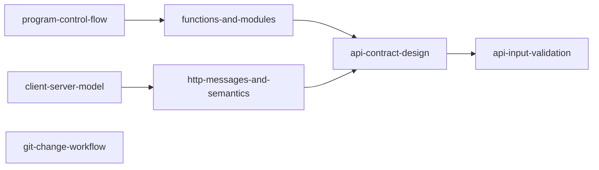

# Skill Dependency Graph

## Prerequisite explanation

`program-control-flow` precedes `functions-and-modules` because a learner must first express behavior before separating it. `client-server-model` precedes HTTP semantics. API design combines modular program thinking with HTTP semantics. Input validation builds on an explicit API contract. Git can be learned in parallel with the other foundation skills.

## Dependency table

| Skill | Direct prerequisites |
|---|---|
| program-control-flow | none |
| functions-and-modules | program-control-flow |
| git-change-workflow | none |
| client-server-model | none |
| http-messages-and-semantics | client-server-model |
| api-contract-design | functions-and-modules, http-messages-and-semantics |
| api-input-validation | api-contract-design |

## Mermaid DAG

The graph is a DAG: every edge advances toward API boundary design and no path returns to an earlier skill.

